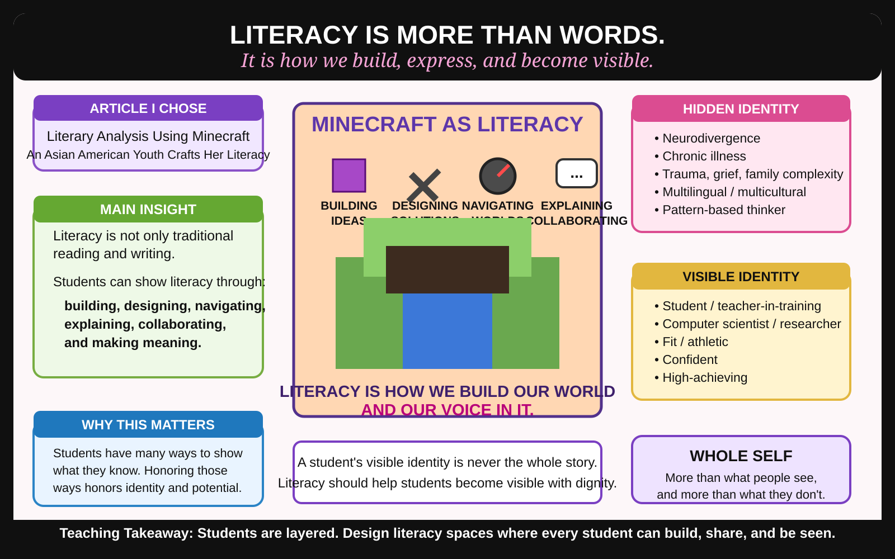

# Class 7 Activities Tracker: Towards a Pursuit of Identity

## Activity 1: Layers of Me — Unearthing Identity

**Status:** Completed in class.

### Final slide content

**Name:** PITER

**Hidden Identity:**
- Neurodivergent
- Chronically ill
- Survivor of childhood trauma, early loss, and family abandonment
- Multilingual/multicultural
- Pattern-based thinker
- Creative connector
- Researcher
- Advocate for students who learn differently

**Visible Identity:**
- Student
- Teacher-in-training
- Computer scientist
- Graduate student
- Researcher
- Fit/athletic
- Confident
- High-achieving

**Whole Self:**
- Resilient, reflective, deeply empathetic, and system-aware.
- My visible strength can hide private complexity, and my lived experiences shape a commitment to seeing students beyond surface assumptions.
- Creative, analytical, caring, and driven to design learning spaces where identities are recognized as part of how we learn, not as barriers to overcome.

### Design note

The underlining in the slide was intentional. It functioned as a neurodivergent-friendly visual cue that marked when one idea ended and another began. The design did not only describe neurodivergent identity; it enacted a neurodivergent-friendly way of organizing meaning.

---

## Activity 2: Weaving Perspectives — A Layered Strand Discussion

**Status:** Completed in class.

### Article chosen

**“Literary Analysis Using Minecraft: An Asian American Youth Crafts Her Literacy.”**

### Main insight

Literacy is not only traditional reading and writing. Students can also show literacy through building, designing, navigating, explaining, collaborating, and making meaning in digital spaces like Minecraft. Minecraft becomes more than a game; it becomes a space where students can represent understanding, creativity, identity, and voice.

### Connection to identity

This reading connects to my identity because I understand what it means to have forms of literacy that are not always recognized in traditional ways. As a scientist or researcher, I often make meaning through systems, patterns, design, and problem-solving, similar to how Minecraft can become a space for building and showing understanding. As a neurodivergent person, I also rely on visual structure, patterns, and clear idea boundaries to process meaning.

My visible identity may show confidence, fitness, achievement, and academic success. My hidden identity includes neurodivergence, chronic illness, trauma, grief, family complexity, and pattern-based thinking. The article helped me connect those layers to teaching because students may also show intelligence and literacy through forms that schools do not always value right away.

### Teaching takeaway

Students are layered. A student may not show literacy in a format we expect, but it does not mean they are not thinking deeply. A student’s visible identity is never the whole story. Literacy should help students become visible with dignity.

---

## Preserved class artifact

The generated standalone infographic image was recreated and preserved as an SVG here:

## Notes for future writing

- This activity can support future EDU498 writing about multimodal literacy, identity-centered literacy, digital spaces, neurodivergent-friendly design, and the idea that literacy should reveal students’ capacities rather than hide them behind narrow school formats.
- Key sentence to reuse: **A student’s visible identity is never the whole story. Literacy should help students become visible with dignity.**
